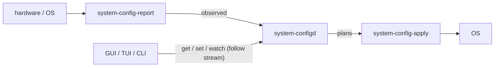

# CodaLinux architecture

How the installed system is laid out: **disk → what lives where → mounts → boot → updates**.

Locked product model: `coda-a` / `coda-b` are the **bootable Arch core only**. Hyprland, AGS/Astal, greetd session chrome, portals, and `system-config*` live on **`coda-data`** so they survive slot swaps.

The **live ISO** is still a full desktop root (do not rip it out). The **install path** splits that image into core vs desktop. Later updates use **`coda-update`**. Read-only remount of the running slot is still later.

Locked *choices* (Hyprland, no NetworkManager, official repos only, …) stay in [DESIGN.md](DESIGN.md). Commands: [docs/sandbox.md](docs/sandbox.md). `system-config` is locked here as **greenfield**.

Do **not** claim a read-only running slot, a core-only live ISO, or gated host `pacman` until those are built. Do **not** claim slots still ship the full live desktop.

## Locked model vs live ISO

| Piece | Locked install model | What this tree does today |
| --- | --- | --- |
| Disk | GPT: `coda-esp` + `coda-a` + `coda-b` + `coda-data` | **Implemented.** First install writes core into A. Slots stay **writable** (RO remount is later). |
| Core OS | Bootable Arch core on A/B only | **Install:** offline split of the live airootfs — core files → slot, desktop files → `/coda/data/desktop`. **Updates:** `coda-update core` pulls Arch repos into the **inactive** slot (`pacman --root`). **Live ISO:** still a full desktop root. |
| Desktop | Hyprland + AGS + greetd chrome on **`coda-data`**, merged at boot | **Installed:** `/coda/data/desktop` + `coda-desktop-mount.service`. **Live:** same desktop on the ISO `/` (do not rip it out). |
| Sandboxes | User-owned disposable Arch roots (`pacman --root` + `bwrap`) | **Implemented:** `coda-sandbox` + `bubblewrap` on live and install lists. |
| Host `pacman` | Core / OS only; gated; writes the **inactive** slot | Ordinary rolling pacman on the mutable root still works (not gated). **Do not** use `sudo pacman -Syu` on `/` as the OS update path. |
| Installer | Pick **disk only**; locale/timezone/keymap fixed (Bozeman) | **Implemented:** `coda-install` asks for one disk (or `CODA_INSTALL_DISK` / `auto`). Offline split. No pacstrap/mirrors at install time. |
| Updates | Core slot swap; desktop stays on data; apps via sandbox `pacman` | **Implemented:** `coda-update core` / `desktop` / `status` (see [Updates](#updates-coda-update)). `coda-slot` remains low-level. |
| System config | `system-configd` + report + apply; clients talk to D only | **Shipped on live ISO** (`core/system-config/`). On an installed disk those binaries travel with the **desktop payload** on data. |

Shipped now: Hyprland + AGS on the live ISO, sandboxes, `system-config`, ESP+A+B+data offline install, **`coda-update`**, **core-only slots + desktop on `coda-data`**. Not shipped: RO running slot, a core-only (~1.1 GiB) *live ISO*, gated host pacman, QEMU **network** e2e of Arch-repo `coda-update core` (offline `--from-iso` e2e is wired).

---

## Partition layout

UEFI-only. One disk. GPT. systemd-boot. Filesystems: FAT32 ESP, ext4 slots and data.

Planner: [`scripts/coda-install-layout.py`](scripts/coda-install-layout.py). Extra disk always goes to **data**, not larger slots.

| PARTLABEL | FS | Planner floor | Role |
| --- | --- | --- | --- |
| `coda-esp` | FAT32 | **1024 MiB** | `/boot` — systemd-boot + A/B kernels |
| `coda-a` | ext4 | **4096 MiB** | Bootable Arch **core** (first install) |
| `coda-b` | ext4 | **4096 MiB** | Inactive twin (empty until `coda-update core`) |
| `coda-data` | ext4 | **8192 MiB** floor; **remainder** | Desktop + `/home` + `/var` |

GPT slack reserved at the end of the disk is **4 MiB**. Minimum disk is **17412 MiB** (~17 GiB = 1024 + 4096 + 4096 + 8192 + 4). Recommend **32 GiB** for QEMU. The planner refuses smaller disks.

**Measured payload today** (not planner floors): ~**54 MiB** on the ESP and ~**1.9 GiB** per core slot. **512 MiB ESP is enough for v1**, including future UKIs in the ~30–80 MiB range. The 1 GiB ESP size is a **conservative planner floor**, not a payload requirement. This document does not change the planner; `ESP_MIB = 1024` stays in code.

**Install:** operator picks the **disk** only. Locale `en_US.UTF-8`, timezone `America/Denver` (Bozeman), keymap `us` — no region prompts.

---

## What each partition stores

### `coda-esp` (`/boot`)

| Path on ESP | What it is |
| --- | --- |
| systemd-boot EFI binaries | Firmware bootloader (`bootctl install`) |
| `loader/loader.conf` | Default entry + timeout |
| `loader/entries/coda-a.conf` | Slot A: `linux` / `initrd` / `root=PARTLABEL=coda-a` |
| `loader/entries/coda-b.conf` | Slot B (placeholder until B has a kernel) |
| `/boot/coda/{a,b}/vmlinuz-linux` | Kernel for that slot |
| `/boot/coda/{a,b}/initramfs-linux.img` | Initramfs for that slot |
| `/boot/coda/{a,b}/*-ucode.img` | CPU microcode, when present |

A and B do **not** share one `vmlinuz-linux`. Loader entries point at `/coda/{a,b}/…` relative to the ESP root (same files as `/boot/coda/{a,b}/` once the ESP is mounted).

### `coda-a` / `coda-b` (core)

Bootable Arch core from [`packages/base.txt`](packages/base.txt) + [`packages/core-slot.txt`](packages/core-slot.txt), expanded through the live pacman db’s **recursive depends**. Written by [`coda-install-split.py`](scripts/coda-install-split.py). **Not** a second pacstrap.

| On the slot | Examples |
| --- | --- |
| Kernel stack | `linux`, `linux-headers`, `linux-firmware`, `amd-ucode`, `intel-ucode` |
| Init / boot | `systemd`, `mkinitcpio`, modules under `/usr/lib/modules` |
| Disk / UEFI tools | `e2fsprogs`, `dosfstools`, `gptfdisk`, `parted`, `efibootmgr`, `rsync` |
| Admin userland | `base` set: sudo, util-linux, iproute2, editors, … |
| Remote / VM | `openssh`, `qemu-guest-agent` |
| Slot-side Coda helpers | `coda-update`, `coda-slot`, install libs (`coda-install-lib.sh`, `coda-install-ab.sh`, split/layout/verify), `coda-desktop-mount` + its unit |
| Enablement | systemd-networkd, sshd, QGA enabled; os-release / locale hooks |
| Slot marker | `/etc/coda/slot` (`a` or `b`) |

**Not on the slot:** Hyprland, AGS/Astal, greetd **binaries**, session chrome, portals, `system-config*`. A greetd **unit + PAM** may live on the slot so systemd can start the greeter *after* the desktop merge; the greetd/Hyprland binaries stay on data.

### `coda-data`

| Path | What it is |
| --- | --- |
| `/coda/data/desktop` | Session payload: Hyprland, AGS, greetd chrome, portals, `system-config*`, Mesa/PipeWire/iwd/BlueZ, apps, `/usr/local` wrappers |
| `/coda/data/home` | Bind-mounted at `/home` (users; `~/.coda/sandbox` lives here) |
| `/coda/data/var` | Bind-mounted at `/var` (logs, caches, host pacman db) |
| `/coda/data/desktop/.coda-desktop-payload` | Marker written by the installer |

Desktop packages = everything installed on the live image that is **not** in the core seed (`hardware.txt`, `network.txt` extras such as iwd, `desktop.txt`, `apps.txt`, `sandbox.txt`, leftover unpackaged session files). Survives slot swaps. **Not** A/B’d in v1.

---

## Mounts at runtime (installed system)

From [`coda_write_fstab`](scripts/coda-install-lib.sh) plus `coda-desktop-mount.service`:

| Mount | Source | How |
| --- | --- | --- |
| `/` | Active slot (`PARTLABEL=coda-a` or `coda-b`) | ext4 root |
| `/boot` | `PARTLABEL=coda-esp` | vfat ESP |
| `/coda/data` | `PARTLABEL=coda-data` | ext4 |
| `/home` | `/coda/data/home` | bind |
| `/var` | `/coda/data/var` | bind |
| `/usr` | core `/usr` + `/coda/data/desktop/usr` | `coda-desktop-mount`: `systemd-sysext` or RO overlay (desktop on top) |
| session `/etc` bits | core `/etc` + `/coda/data/desktop/etc` | `systemd-confext` or RO overlay when the desktop tree has `etc/` |

`/bin`, `/sbin`, `/lib` are stock Arch usr-merge symlinks into `/usr`. `/dev`, `/proc`, `/sys`, `/run`, `/tmp` are ordinary runtime.

Desktop is **not** a fstab bind. `coda-desktop-mount.service` (core, on the slot) runs after `local-fs.target` / `coda-data.mount` and before greetd / `graphical.target`.

The **live ISO** does not run this unit (no `coda-data`).

---

## Boot sequence

What exists at each stage. Default entry is whatever `promote` last set (`coda-a.conf` after a fresh install).

| Stage | What runs | What is available |
| --- | --- | --- |
| 1. UEFI | Firmware finds systemd-boot on `coda-esp` | Disk GPT only |
| 2. systemd-boot | Loads the **default** entry (`loader/loader.conf`), unless a **oneshot** from `boot-test` is pending | A/B entries on the ESP |
| 3. Kernel | `linux /coda/{a\|b}/vmlinuz-linux` + initramfs (+ microcode) from the ESP | Kernel in RAM; root not mounted |
| 4. Root | `root=PARTLABEL=coda-{a\|b} rw rootfstype=ext4` | Active **core** is `/` |
| 5. systemd (core) | PID 1 from the slot | getty, sshd, QGA, networkd — **no Hyprland yet** |
| 6. Data + binds | fstab mounts `coda-data` at `/coda/data`, then bind `/home` and `/var` | User homes + host `/var` |
| 7. `coda-desktop-mount` | sysext/confext, else RO overlay of desktop over `/usr` (and `/etc`) | Desktop files visible on `/` |
| 8. Session | greetd → `coda-hyprland` → Hyprland + AGS | Full desktop |

**If desktop merge fails** (missing `/coda/data/desktop/usr`, sysext/overlay error, or empty payload): the unit **exits successfully**. Core continues — **sshd, QGA, getty**. No greetd/Hyprland/AGS. Do not copy Hyprland back onto the slot to “make the session work.”

| What broke | Still works | Does not |
| --- | --- | --- |
| `/coda/data/desktop` missing or empty | Slot boots; sshd; QGA; getty | greetd / Hyprland / AGS |
| Desktop tree present but Hyprland/AGS broken | Same core services; `/usr` merge may still succeed | Graphical session |
| `coda-desktop-mount` overlay/sysext fails | Core `/` unchanged (no merge) | Graphical session |
| `coda-update desktop` (or `--from-iso`) refreshed desktop, then B oneshot failed | Previous slot remains the boot **default**; that core still boots | Desktop on data is already the new payload (not A/B’d) |

---

## Updates (`coda-update`)

Documented UI: [`coda-update`](scripts/coda-update). It never writes the **running** slot. Product path for core is **Arch repo pull** (`pacman --root` into the inactive slot), not `sudo pacman -Syu` on `/`.

| Command | What it does | Boot default |
| --- | --- | --- |
| `coda-update core` | Format the **inactive** slot; pull **core** packages from Arch (`packages/base.txt` + `core-slot.txt`) into that slot; refresh kernel/ESP; `bootctl set-oneshot` | **Unchanged**. Next reboot is oneshot. A failed boot keeps the previous default |
| `coda-update core --promote` | `bootctl set-default` for the **running** slot only (after a successful oneshot boot) | **Flips** to that slot |
| `coda-update desktop` | Pull desktop package set from Arch into a staging root on **coda-data**; rsync classified files onto `/coda/data/desktop`. `/home` and core slots stay | — |
| `coda-update status` | Active / inactive / `loader.conf` default | — |
| `coda-update core --from-iso` | Offline ISO split (same payload as first install). **Implemented** for live ISO / current QEMU e2e (no NIC). Not the long-term product path | Same oneshot rules as `core` |

[`coda-slot`](scripts/coda-slot) remains the low-level A/B helper (`install` / `boot-test` / `promote`) used by `--from-iso` and e2e. Prefer `coda-update` in docs and the happy path.

**Implemented:** CLI, refuse-running-slot (letter **and** PARTLABEL of `/`), refuse writing the live ISO **boot-default** slot (so a post-promote live update does not re-format B), PARTLABEL/space preflight, ESP ready-check (entry + vmlinuz + initramfs) before oneshot, oneshot must leave `loader.conf` default, promote verifies `loader.conf` and is idempotent, mount cleanup on mid-update failure, Arch `pacman --root` into the inactive slot / desktop staging tree, oneshot then `--promote`, ISO wiring, host CLI tests. **Not claimed green:** full QEMU **network** pacman e2e of `coda-update core` (this tree’s e2e VM has no NIC). Hook: `CODA_E2E_CORE_FROM=repos` in [`qemu-install-e2e.sh`](scripts/qemu-install-e2e.sh). Vendored AGS/hyprbars are **not** replaced by `coda-update desktop` (delete=0 on `/usr/local`).

**Follow-ups (not blockers):** read-only remount of the running slot; A/B’ing the desktop payload as a second pair (today `coda-update desktop` refreshes `/coda/data/desktop` in place).

From a running installed system, `--disk` is optional. From the live ISO, pass `--disk /dev/vda` (or `CODA_INSTALL_DISK=auto`).

Desktop refresh is **not** a third A/B pair. Apps / extras stay in `coda-sandbox`. User files stay on data (`/home`).

---

## How the active core is set

| Moment | Active core | Inactive |
| --- | --- | --- |
| Fresh install (`coda-install` → [`coda-install-ab.sh`](scripts/coda-install-ab.sh)) | **A**: core written to `coda-a`; `bootctl set-default coda-a.conf` | **B**: formatted placeholder (`/etc/coda/empty`), `coda-b.conf` points at a kernel that is not there yet |
| After `coda-update core` | Next reboot is the oneshot slot **once** | Default entry is still the previous slot |
| After `coda-update core --promote` | Default = the running slot | The other slot |
| Any boot | **Running** slot = PARTLABEL of `/` (`coda-a` or `coda-b`; also `/etc/coda/slot`) | The other PARTLABEL |

`coda-update status` (and `coda-slot status`) print `active` from the running root (or “live ISO”), `inactive` as the other letter, and `boot-default` from `loader/loader.conf`.

---

## Layers

```
┌─────────────────────────────────────────────────────────┐
│  4. User data     /home  (includes ~/.coda/sandbox)     │
├─────────────────────────────────────────────────────────┤
│  3. Sandboxes     disposable Arch roots + bwrap         │
│                   many packages per named root          │
├─────────────────────────────────────────────────────────┤
│  2. Desktop       Hyprland + AGS + branding (on data)   │
├─────────────────────────────────────────────────────────┤
│  1. Core OS       bootable Arch on coda-a / coda-b      │
│                   NOT the full Hyprland/AGS image       │
└─────────────────────────────────────────────────────────┘
```

| # | Layer | What it is | How it is updated |
| --- | --- | --- | --- |
| 1 | **Core OS** | Bootable Arch core on A/B. **Not** a full Hyprland/AGS root. | `coda-update core` into the **inactive** slot (Arch repos), oneshot, then `--promote`. |
| 2 | **Desktop** | Hyprland + vendored AGS/Astal + greetd + branding + official settings. A **session**, not “the OS”. | `coda-update desktop` on `coda-data` (`/coda/data/desktop`), merged at boot. Live ISO still ships it on the same image. |
| 3 | **Sandboxes** | Disposable Arch filesystem trees. Isolation is **upstream bubblewrap** only. | `coda-sandbox install` (repeatable into the same env). Destroy and recreate. |
| 4 | **User data** | `/home` (and later other data mounts). | Ordinary files. Sandbox trees live here so they survive OS slot swaps. |

Do not collapse this back into “`pacman -S postgres` on the host.”

---

## Desktop on coda-data (required)

Prefer a simple bootable path over overlay cleverness.

### On-disk layout

```
/coda/data/
  home/                 bind-mounted at /home
  var/                  bind-mounted at /var
  desktop/              session payload (rsync of airootfs desktop files)
    usr/                Hyprland, Mesa, PipeWire, apps, /usr/local AGS…
    etc/                greetd, hypr xdg/skel, session units, …
    usr/lib/extension-release.d/extension-release.coda-desktop
    etc/extension-release.d/extension-release.coda-desktop
  desktop/.coda-desktop-payload   marker file written by the installer
```

Installer (and `coda-update core --from-iso`) classify the live airootfs **offline** (no pacstrap):

1. **Core seed** = [`packages/base.txt`](packages/base.txt) + [`packages/core-slot.txt`](packages/core-slot.txt) (`rsync`, `efibootmgr`), expanded through the live pacman db’s recursive depends.
2. **Desktop packages** = every other installed package on the live image (`hardware.txt`, `network.txt` extras such as iwd, `desktop.txt`, `apps.txt`, `sandbox.txt`, live-only leftovers that are not core deps).
3. **Unpackaged files** (`/usr/local` wrappers, vendored AGS/hyprbars, branding helpers): explicit lists. Installer / `coda-update` / `coda-slot` / `coda-desktop-mount` stay on the **slot**. `coda-hyprland`, `coda-ags`, system-config*, session chrome stay on **data**.
4. `/var` from the live image is seeded onto `/coda/data/var` (already a data bind). `/home` likewise. Slots only get empty `/home` and `/var` mountpoints.

`coda-install-split.py` builds the two rsync file lists. Slots are never used as a staging area for the full desktop (a 4 GiB slot cannot hold it).

### Boot merge (v1)

`coda-desktop-mount.service` is **core** (installed on the slot). It runs after `/coda/data` is mounted and before greetd / `graphical.target`:

1. If `/coda/data/desktop/usr` is missing or empty → **log and exit successfully**. Core continues (getty, sshd, QGA). No Hyprland.
2. Otherwise try `systemd-sysext merge` (and `systemd-confext merge` for `/etc`) with `/run/extensions/coda-desktop` → `/coda/data/desktop`.
3. If sysext/confext is missing or fails → mount a **read-only overlay**: `lowerdir=/coda/data/desktop/usr:/usr` over `/usr`, and the same idea for `/etc` when the desktop tree has `etc/`. Desktop wins; slot files remain the bottom layer.

No initramfs rewrite in v1. Live ISO boot does **not** run this unit (no `coda-data`).

Verify must see Hyprland under `/coda/data/desktop`, not as a slot-only file.

---

## Sandboxes (implemented)

Path spelling is locked: **`~/.coda/sandbox/<env>`** (singular `sandbox`).

```
~/.coda/sandbox/<env>/         sandbox directory
~/.coda/sandbox/<env>/root     pacman --root tree
~/.coda/sandbox/<env>/meta
~/.coda/cache/pacman           shared cache for this user
```

- **User-owned. No sudo** for create / install / shell / exec / destroy.
- `pacman --root` runs in `unshare --user --map-root-user` (optional `--keep-caps`) so extract sees uid 0 and files on disk stay owned by the real user. Uses a generated `~/.coda/cache/pacman/pacman.conf` (`DownloadUser = root`, `DisableSandbox`) — not host `/etc/pacman.conf`. Bootstrap is `base iptables` plus CLI `--noconfirm` (no `NoConfirm` key — pacman rejects it). After bootstrap, `/etc/os-release` is linked to `../usr/lib/os-release` (tmpfiles does not run under `--root`).
- `shell` / `exec` are unprivileged **upstream `bwrap`**. Sandbox `/etc/resolv.conf` is a regular file (not a `/run` symlink). `destroy` chmod-then-rm so `555` dirs go away. CodaLinux does not reimplement bubblewrap.
- **One env = one Arch root = many packages/apps.** Example: `dev` with `postgresql`, `redis`, `git` via repeated `coda-sandbox install dev …`. Not one sandbox per app.
- Host `pacman` = **core / OS only** (rare; gated later). Extra software goes in a sandbox.
- Shared cache is a deliberate choice: one download of `base`, many installs. Override with `--store` / `CODA_SANDBOX_STORE` or `--cache` / `CODA_SANDBOX_CACHE`.
- Not `/var/coda`, not `/var/lib/coda`, not XDG `~/.local/share/…` as the primary path.

`~/.coda` is created on first use (`0700`). No system tmpfiles under `/var` for the store.

```bash
coda-sandbox create <env>
coda-sandbox install <env> postgresql
coda-sandbox install <env> redis git
coda-sandbox shell <env>
coda-sandbox exec <env> postgres --version
coda-sandbox destroy <env>
```

Needs Arch/CodaLinux, official `core`/`extra`, a working keyring, network for the first `create`, `bubblewrap`, and unprivileged user namespaces. Details: [docs/sandbox.md](docs/sandbox.md).

## system-config

**Implemented** (Go) in [`core/system-config/`](core/system-config/README.md) and **wired onto the live ISO** (`/usr/local/bin/system-config*` plus user `system-configd`/`system-config-report` and root `system-config-apply`). Greenfield — **no migrate path** from `coda-settings` and **no compatibility layer** in v1.

**Desktop cutover:** AGS Control Center, bar audio/Wi-Fi/Bluetooth, and `/usr/share/applications/system-config-gui.desktop` launch **`system-config-gui`**. That client talks to `system-configd` only. Session chrome (wallpaper, workspaces, GTK, gaps) uses the dedicated helpers, not `coda-settings`. `coda-settings` remains on the image as `NoDisplay=true` for scripts; it is not a Settings app. On an installed disk these binaries travel with the **desktop payload** on data.

Picture: [DESIGN.md](DESIGN.md#system-config) (locked one-liner). This section is the canonical architecture.

### Daemons

| Daemon | Privilege | Role |
| --- | --- | --- |
| `system-configd` | unprivileged | Control plane. Owns the JSON model (**desired** + **observed**). **Only** API clients talk to it. Submodel get / set / watch (optional follow stream when observed changes). Asks **report** to refresh observed; asks **apply** to execute plans. |
| `system-config-apply` | root | Typed, allowlisted executor. Runs **plans from D only**. No model. No client API. |
| `system-config-report` | mostly unprivileged (root only when a probe needs it) | Hardware / stack inventory + observers. YaST / hwinfo *classed probe* idea; modern *udev event* style. Pushes or pulls **observed** into D. **Never** applies config. |

### Clients (talk to D only)

| Client | Role |
| --- | --- |
| `system-config` | CLI |
| `system-config-tui` | Terminal Settings (every KnownPath; per-section Apply; D only) |
| `system-config-gui` | Settings UI on **uitoolkit `dev` (v0.19.x)** — composed prefs shell (`ListView` rail + section chrome, per-section Apply, app-level socket client). No PrefsPage/NavRail in the toolkit; remaining gaps in [`core/system-config/docs/uitoolkit-gaps.md`](core/system-config/docs/uitoolkit-gaps.md) do not block. |

Clients never call report or apply. They query **submodels**, not the entire model by default.

### Flow



```
hardware / OS → system-config-report → observed → system-configd ← GUI/TUI/CLI
                                                    │ plans
                                                    ▼
                                            system-config-apply → OS
```

### Detection layers

| Layer | What | When |
| --- | --- | --- |
| **L0 inventory** | udev + sysfs + DMI; enrich with systemd hwdb | Always-on baseline. Stable device ids. Event-driven (udev), not Kudzu-style boot prompts. |
| **L1 deep probe** | Optional hwinfo / lshw-class scans | On demand / support. **Not** the live heartbeat. Lazy — do not block settings domains on a full PCI walk. |
| **L2 runtime domains** | Live stacks: Hyprland, iwd / networkd, PipeWire, BlueZ, logind | Map to display / network / audio / bluetooth / session. |
| **L3 status flags** | YaST-inspired: `present` / `configured` / `changed` / `apply_error` | Per submodel object, from observed vs desired and apply results. |

### Submodels

Clients ask D for one of these (or a child path), not a dump of the whole tree. Implemented in [`core/system-config/`](core/system-config/README.md):

| Submodel | Typical L2 / L0 source | Set / apply |
| --- | --- | --- |
| `display` | Hyprland (outputs, modes, scale, position) | yes |
| `network` | iwd + systemd-networkd (scan quality, DNS/search, airplane/rfkill; no NetworkManager) | yes |
| `audio` | PipeWire (`pw-dump` / `wpctl`) full sink/source names | yes |
| `bluetooth` | BlueZ **D-Bus** (pairing agent); `bluetoothctl --timeout` fallback | yes |
| `input` | localectl / vconsole + Hyprland `hl.input` (persisted) | yes |
| `datetime` | timedatectl (timezone, NTP, time). NTP falls back to `systemctl --runtime` + start/stop of `systemd-timesyncd` when `/etc` is confext/RO (installed core-only) | yes |
| `locale` | locale.conf / localectl | yes |
| `session` | logind (sessions, seats, idle inhibit) | lock only |
| `power` | logind + backlight sysfs | suspend/hibernate, brightness, lid. **Not** reboot/poweroff |
| `printers` | CUPS (`lpstat` / `lpadmin`) when present | default + enable (`present=false` if no cups) |
| `users` | `/etc/passwd` local accounts | login shell only (`usermod -s`) |
| `storage` | lsblk / udisks / sysfs block | mount/unmount via `udisksctl` (`present=false` if none; system mounts refused) |
| `devices.summary` | DMI + sysfs counts | observe |
| `devices.pci` | sysfs (L1, lazy) | observe |
| `devices.usb` | sysfs | observe |
| `hardware.dmi` | DMI | observe |

Add further submodels the same way: one domain, one path, observed + desired + L3 flags.

### Rules

1. Clients never call report or apply directly — **only D**.
2. Report never writes system config.
3. Apply never invents policy — it only executes D’s plan (closed allowlist, **no** arbitrary shell).
4. From scratch — **no** deprecation or migrate tooling in v1.

---

## How to try what exists

Do not rebuild the ISO just to read this document. The desktop image already includes `bubblewrap` (`packages/sandbox.txt`) and `/usr/local/bin/coda-sandbox`.

1. **Desktop UX** (Hyprland / AGS): `./scripts/qemu-desktop-dev.sh` — 9p share; `coda-sync-desktop-from-host.sh` copies wrappers including `coda-sandbox`.
2. **Sandbox helper** (on a live/Arch session with network): the commands in [Sandboxes](#sandboxes-implemented). First `create` bootstraps `base` and needs `pacman` on the host. This is **not** an A/B disk test.
3. **ISO smoke**: `./scripts/qemu-boot-test.sh` after `./scripts/build-iso.sh`. Confirms the live desktop image.
4. **Install + A/B e2e** (abox, **local ISO only**, no prompts, never GitHub ISO artifacts): `./scripts/qemu-install-e2e.sh` — first disk → offline **core** install into A + desktop onto `coda-data` → reboot Hyprland `user`/`1` (from **data**) → `coda-update core --from-iso` into B (oneshot) → reboot B → `coda-update core --promote` → reboot B. Guest-only via QGA. Do not run system-config daemons on the host. Arch-repo `coda-update core` is **not** claimed green here (no NIC); hook `CODA_E2E_CORE_FROM=repos`.
5. **system-config (Go, on the live ISO):** `cd core/system-config && CGO_ENABLED=0 go test ./...`. Ship `system-config-gui` with `CGO_ENABLED=1` (uitoolkit Wayland/X11); CGO-off is offscreen-only. The Settings wrapper defaults `UITK_PAINT=cpu` on virtio. Run order: [core/system-config/README.md](core/system-config/README.md). Guest QEMU smoke: `core/system-config/scripts/guest-smoke.sh --guest` (refuses unless `--guest` and `ID=codalinux`).

Live boot: systemd-boot `timeout 1`. `pacman-init` is **off the greeter critical path** (timer after `graphical.target`, not `WantedBy=multi-user.target`). `ldconfig.service` must not rebuild the linker cache on every live boot: squashfs already has `/etc/ld.so.cache`. The drop-in resets stock `Condition*` (empty assignment clears **all** of them), then requires `ConditionFileNotEmpty=!/etc/ld.so.cache` so a non-empty cache skips the unit. See [DESIGN.md](DESIGN.md#service-enablement).

RO remount of the running slot, a core-only (~1.1 GiB) *live ISO*, and gated host pacman are **future work** ([docs/TODO.md](docs/TODO.md) §5). ESP+A+B+data install, core-only slots, desktop-on-data, and **`coda-update`** are implemented. `coda-slot` stays as the low-level helper. `system-config` is implemented in-tree and ISO-wired; try it via [core/system-config/README.md](core/system-config/README.md).
