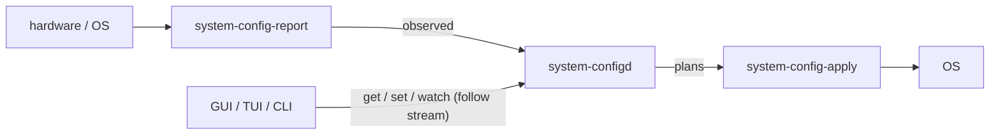

# CodaLinux architecture

Canonical picture of **how the entire system looks**: partitions → layers → `/` folders → sandboxes → **system-config** → updates.

- **Target** is the locked product intent (required). `coda-a` / `coda-b` are the **bootable Arch core only**. Hyprland, AGS/Astal, greetd session chrome, and the rest of the live desktop live on **`coda-data`** so they survive slot swaps.
- **Current tree** is what this repository actually builds today. Be honest: the **live ISO** is still a full desktop root (do not rip it out). The **install / `coda-slot` path** is what implements the core-vs-desktop split. Read-only remount of the running slot is still target.
- Locked *choices* (Hyprland, no NetworkManager, official repos only, …) stay in [DESIGN.md](DESIGN.md). Commands: [docs/sandbox.md](docs/sandbox.md). `system-config` is locked here as **greenfield**; the Go daemons/clients are implemented and ISO-wired.

Do **not** claim a read-only running slot, a core-only live ISO, or gated host `pacman` work until those are built. Do **not** claim slots still ship the full live desktop — that was Current before the install split; it is no longer the required install model.

## Target vs current (read this first)

| Piece | Target (required) | Current tree |
| --- | --- | --- |
| Disk | ESP + OS-A + OS-B + data | **Implemented:** GPT `coda-esp` + `coda-a` + `coda-b` + `coda-data`. First install is OS-A. Slots stay **writable** (RO remount is still target). |
| Core OS | Bootable Arch core only on A/B (`base` + `linux` + firmware + mkinitcpio + microcode + systemd + boot). ~4 GiB slot floor. RO while running (later). | **Live ISO:** still a **full desktop root** (core + Hyprland + AGS on one `/`). **Install / `coda-slot`:** offline split of that airootfs — core files → slot, desktop files → `/coda/data/desktop`. Not a second pacstrap. |
| Desktop | Hyprland + AGS + greetd chrome + the rest of the session on **`coda-data`**, merged onto `/` at boot | **Live:** Hyprland + vendored AGS on the ISO (do not rip it out). **Installed:** `/coda/data/desktop` + `coda-desktop-mount.service` (overlay / `systemd-sysext`). |
| Sandboxes | User-owned disposable Arch roots (`pacman --root` + upstream `bwrap`) | **Implemented:** `coda-sandbox` + `bubblewrap` on live and install lists |
| Host `pacman` | Core / OS only; gated; writes the **inactive** slot | Ordinary rolling pacman on the mutable root (not gated). `/var` (including the pacman db) already lives on `coda-data`. |
| Installer | Pick **disk only**; locale/timezone/keymap fixed (Bozeman) | **Implemented:** `coda-install` asks for one disk (or `CODA_INSTALL_DISK` / `auto`). Offline airootfs split into OS-A (core) + `coda-data/desktop`. No pacstrap/mirrors at install time. |
| Updates | OS slot swap (core); desktop stays on data; apps via sandbox `pacman` | **Implemented:** `coda-slot install` writes **core** into the inactive slot and refreshes `/coda/data/desktop` from the same live ISO. Kernel + initramfs on the ESP under `/boot/coda/{a,b}`. `boot-test` is oneshot; `promote` flips the default. |
| System config | `system-configd` + report + apply; CLI/TUI/GUI talk to D only | **Shipped on live ISO:** Go module `core/system-config/` (binaries + systemd user/system units). **Desktop Settings is `system-config-gui` only.** On an installed disk those binaries travel with the **desktop payload** on data. AGS session chrome calls `coda-wallpaper` / `coda-hypr-ws` / `nwg-look` / `hyprctl` directly. `coda-settings` is a hidden helper, not a Settings app. No migrate. |

Shipped and tryable now: **Hyprland + AGS desktop** on the live ISO, **`bubblewrap`**, **`coda-sandbox`** under `~/.coda/sandbox/<env>/`, **`system-config`** daemons/clients, **ESP+A+B+data offline install**, **`coda-slot`** inactive-slot write / oneshot boot-test / promote, **core-only slots + desktop on `coda-data`**. Not shipped: read-only running slot, a core-only (~1.1 GiB) *live ISO*, gated host pacman. Before this split, `coda-install` / `coda-slot` copied the **full** live airootfs into every OS slot — that is no longer the required model.

## Partitions (target)

UEFI-only. systemd-boot. Default filesystems: FAT32 ESP, ext4 OS slots and data.

| Partition | Size (intent) | FS | Mount / role |
| --- | --- | --- | --- |
| ESP | **~1 GiB** (locked; not 2 GiB) | FAT32 | `/boot` — systemd-boot, A/B boot entries, UKI/kernel/initramfs |
| OS-A | **~4 GiB floor** | ext4 | Bootable **Arch core only** (`base` + `linux` + firmware + mkinitcpio + microcode + systemd + boot). **Not** Hyprland / AGS / greetd chrome. **Read-only** when this slot is running (later) |
| OS-B | **~4 GiB floor** | ext4 | Inactive twin of OS-A. Gated OS updates write here, then flip the boot entry |
| data | remainder (**≥ 8 GiB floor**) | ext4 | `/coda/data` — bind `/home` + `/var`, plus **`/coda/data/desktop`** (Hyprland + AGS + the rest of the session). Survives slot swaps |

**Install:** operator picks the **disk** only. Locale `en_US.UTF-8`, timezone `America/Denver` (Bozeman), keymap `us` — **no region prompts**.

**Current tree:** `coda-install` creates this table. Slot floor is **4 GiB** because the slot payload is core-only (the old 8 GiB floor existed only when v1 copied the full live desktop into each slot). Data floor is **8 GiB** so the desktop tree + `/home` + `/var` fit. Minimum disk **~17 GiB** (1 + 4 + 4 + 8 + GPT slack). Recommend **32 GiB** for QEMU. `/home` and `/var` bind from `coda-data`. Desktop is **not** duplicated into every OS slot.

## Layers

```
┌─────────────────────────────────────────────────────────┐
│  4. User data     /home  (includes ~/.coda/sandbox)     │
├─────────────────────────────────────────────────────────┤
│  3. Sandboxes     disposable Arch roots + bwrap         │
│                   many packages per named root          │
├─────────────────────────────────────────────────────────┤
│  2. Desktop       Hyprland + AGS + branding (session)   │
├─────────────────────────────────────────────────────────┤
│  1. Core OS       bootable Arch (~1.1 GiB class)        │
│                   NOT the full Hyprland/AGS image       │
└─────────────────────────────────────────────────────────┘
```

| # | Layer | What it is | How it is updated |
| --- | --- | --- | --- |
| 1 | **Core OS** | Bootable Arch: `base` + `linux` + firmware + mkinitcpio + microcode + systemd + boot. **Not** a full Hyprland/AGS root. | Host `pacman` into the **inactive** slot (gated). Reboot into the new slot. |
| 2 | **Desktop** | Hyprland + vendored AGS/Astal + greetd + branding + official settings apps. A **session**, not “the OS”. | **Required:** lives on `coda-data` (`/coda/data/desktop`), merged at boot. Live ISO still ships it on the same image (do not rip it out). |
| 3 | **Sandboxes** | Disposable Arch filesystem trees. Isolation is **upstream bubblewrap** only. | `coda-sandbox install` (repeatable into the same env). Destroy and recreate. |
| 4 | **User data** | `/home` (and later other data mounts). | Ordinary files. Sandbox trees live here so they survive OS slot swaps. |

Do not collapse this back into “`pacman -S postgres` on the host.”

## `/` mapping

### Target (after A/B + data split)

```
Core (slot; RO while running — later)
  /usr              Arch core userland (base, systemd, linux modules, firmware)
  /boot             ESP: systemd-boot + A/B entries + kernel
  /etc              Base OS config (fstab, coda slot marker, users, networkd)
  /bin /sbin /lib   usr-merge symlinks into /usr (stock Arch)

Data (writable, survives slot swaps)
  /coda/data            data filesystem root
  /coda/data/home       → bind /home   (users; ~/.coda/sandbox lives here)
  /coda/data/var        → bind /var    (host logs, caches, pacman db)
  /coda/data/desktop    desktop payload (Hyprland, AGS, greetd chrome, apps)
                        merged onto /usr (and /etc session bits) at boot

Runtime (not persisted as “the OS”)
  /dev /proc /sys   kernel interfaces
  /run /tmp         ephemeral

Apps
  Prefer coda-sandbox roots, not host /opt or host /usr pollution
```

### Current tree

OS-A or OS-B is a writable **core** root (`/` + core `/usr` + core `/etc`). `coda-data` is mounted at `/coda/data` and bind-mounted at `/home` and `/var`. Desktop files live at `/coda/data/desktop` and are merged by `coda-desktop-mount.service` after `local-fs.target` (overlay on `/usr` and `/etc`, or `systemd-sysext` / `systemd-confext` when those tools work). Sandbox trees live under `~/.coda/sandbox/` on data. usr-merge is stock Arch. The running slot is **not** remounted read-only yet.

The **live ISO** is unchanged: one full desktop airootfs. Only the offline install / `coda-slot` path splits it.

## Desktop on coda-data (required)

This is the locked install model. Prefer a simple bootable path over overlay cleverness.

### On-disk layout

```
/coda/data/
  home/                 bind-mounted at /home
  var/                  bind-mounted at /var
  desktop/              session payload (rsync of airootfs desktop files)
    usr/                Hyprland, Mesa, PipeWire, apps, /usr/local AGS…
    etc/                greetd, hypr xdg/skel, session units, …
    usr/lib/extension-release.d/extension-release.coda-desktop
    etc/extension-release.d/extension-release.coda-desktop
  desktop/.coda-desktop-payload   marker file written by the installer
```

Installer / `coda-slot` classify the live airootfs **offline** (no pacstrap):

1. **Core seed** = [`packages/base.txt`](packages/base.txt) + [`packages/core-slot.txt`](packages/core-slot.txt) (`rsync`, `efibootmgr`), expanded through the live pacman db’s recursive depends.
2. **Desktop packages** = every other installed package on the live image (`hardware.txt`, `network.txt` extras such as iwd, `desktop.txt`, `apps.txt`, `sandbox.txt`, live-only leftovers that are not core deps).
3. **Unpackaged files** (`/usr/local` wrappers, vendored AGS/hyprbars, branding helpers): explicit lists. Installer / `coda-slot` / `coda-desktop-mount` stay on the **slot**. `coda-hyprland`, `coda-ags`, system-config*, session chrome stay on **data**.
4. `/var` from the live image is seeded onto `/coda/data/var` (already a data bind). `/home` likewise. Slots only get empty `/home` and `/var` mountpoints.

`coda-install-split.py` builds the two rsync file lists. Slots are never used as a staging area for the full desktop (a 4 GiB slot cannot hold it).

### Boot merge (v1)

`coda-desktop-mount.service` is **core** (installed on the slot). It runs after `/coda/data` is mounted and before greetd / `graphical.target`:

1. If `/coda/data/desktop/usr` is missing or empty → **log and exit successfully**. Core continues (getty, sshd, QGA). No Hyprland.
2. Otherwise try `systemd-sysext merge` (and `systemd-confext merge` for `/etc`) with `/run/extensions/coda-desktop` → `/coda/data/desktop`.
3. If sysext/confext is missing or fails → mount a **read-only overlay**: `lowerdir=/coda/data/desktop/usr:/usr` over `/usr`, and the same idea for `/etc` when the desktop tree has `etc/`. Desktop wins; slot files remain the bottom layer.

No initramfs rewrite in v1. Live ISO boot does **not** run this unit (no `coda-data`).

### Failure modes

| What broke | What still works | What does not |
| --- | --- | --- |
| `/coda/data/desktop` missing or empty | Slot boots; sshd; QGA; getty on tty | greetd / Hyprland / AGS |
| Desktop tree present but Hyprland/AGS broken | Same core services; `/usr` merge may still succeed | Graphical session |
| `coda-desktop-mount` overlay/sysext fails | Core `/` is unchanged (no merge) | Graphical session; `coda-install-verify --boot` Hyprland checks fail |
| `coda-slot install` refreshes desktop, then B boot-test fails | Previous slot remains the boot **default**; core on A still boots | Desktop on data is already the new payload (not A/B’d). Session may not match the running core until you rewrite desktop or promote a matching slot. |
| Slot has no Hyprland binary of its own | Expected. Verify must see Hyprland under `/coda/data/desktop`, not as a slot-only file. | — |

Do not copy Hyprland/AGS back onto the slot “so the session works” — that reverts to full-desktop-in-slot.

## Sandboxes (implemented)

Path spelling is locked: **`~/.coda/sandbox/<env>`** (singular `sandbox`).

```
~/.coda/sandbox/<env>/         sandbox directory
~/.coda/sandbox/<env>/root     pacman --root tree
~/.coda/sandbox/<env>/meta
~/.coda/cache/pacman           shared cache for this user
```

- **User-owned. No sudo** for create / install / shell / exec / destroy.
- `pacman --root` runs in `unshare --user --map-root-user` (optional `--keep-caps`) so extract sees uid 0 and files on disk stay owned by the real user. Uses a generated `~/.coda/cache/pacman/pacman.conf` (`DownloadUser = root`, `DisableSandbox`) — not host `/etc/pacman.conf`. Bootstrap is `base iptables` plus CLI `--noconfirm` (no `NoConfirm` key — pacman rejects it). After bootstrap, `/etc/os-release` is linked to `../usr/lib/os-release` (tmpfiles does not run under `--root`).
- `shell` / `exec` are unprivileged **upstream `bwrap`**. Sandbox `/etc/resolv.conf` is a regular file (not a `/run` symlink). `destroy` chmod-then-rm so `555` dirs go away. CodaLinux does not reimplement bubblewrap.
- **One env = one Arch root = many packages/apps.** Example: `dev` with `postgresql`, `redis`, `git` via repeated `coda-sandbox install dev …`. Not one sandbox per app.
- Host `pacman` = **core / OS only** (rare; gated later). Extra software goes in a sandbox.
- Shared cache is a deliberate choice: one download of `base`, many installs. Override with `--store` / `CODA_SANDBOX_STORE` or `--cache` / `CODA_SANDBOX_CACHE`.
- Not `/var/coda`, not `/var/lib/coda`, not XDG `~/.local/share/…` as the primary path.

`~/.coda` is created on first use (`0700`). No system tmpfiles under `/var` for the store.

```bash
coda-sandbox create <env>
coda-sandbox install <env> postgresql
coda-sandbox install <env> redis git
coda-sandbox shell <env>
coda-sandbox exec <env> postgres --version
coda-sandbox destroy <env>
```

Needs Arch/CodaLinux, official `core`/`extra`, a working keyring, network for the first `create`, `bubblewrap`, and unprivileged user namespaces. Details: [docs/sandbox.md](docs/sandbox.md).

## system-config

**Implemented** (Go) in [`core/system-config/`](core/system-config/README.md) and **wired onto the live ISO** (`/usr/local/bin/system-config*` plus user `system-configd`/`system-config-report` and root `system-config-apply`). Greenfield — **no migrate path** from `coda-settings` and **no compatibility layer** in v1.

**Desktop cutover:** AGS Control Center, bar audio/Wi-Fi/Bluetooth, and `/usr/share/applications/system-config-gui.desktop` launch **`system-config-gui`**. That client talks to `system-configd` only. Session chrome (wallpaper, workspaces, GTK, gaps) uses the dedicated helpers, not `coda-settings`. `coda-settings` remains on the image as `NoDisplay=true` for scripts; it is not a Settings app.

Picture: [DESIGN.md](DESIGN.md#system-config) (locked one-liner). This section is the canonical architecture.

### Daemons

| Daemon | Privilege | Role |
| --- | --- | --- |
| `system-configd` | unprivileged | Control plane. Owns the JSON model (**desired** + **observed**). **Only** API clients talk to it. Submodel get / set / watch (optional follow stream when observed changes). Asks **report** to refresh observed; asks **apply** to execute plans. |
| `system-config-apply` | root | Typed, allowlisted executor. Runs **plans from D only**. No model. No client API. |
| `system-config-report` | mostly unprivileged (root only when a probe needs it) | Hardware / stack inventory + observers. YaST / hwinfo *classed probe* idea; modern *udev event* style. Pushes or pulls **observed** into D. **Never** applies config. |

### Clients (talk to D only)

| Client | Role |
| --- | --- |
| `system-config` | CLI |
| `system-config-tui` | Terminal Settings (every KnownPath; per-section Apply; D only) |
| `system-config-gui` | Settings UI on **uitoolkit `dev` (v0.19.x)** — composed prefs shell (`ListView` rail + section chrome, per-section Apply, app-level socket client). No PrefsPage/NavRail in the toolkit; remaining gaps in [`core/system-config/docs/uitoolkit-gaps.md`](core/system-config/docs/uitoolkit-gaps.md) do not block. |

Clients never call report or apply. They query **submodels**, not the entire model by default.

### Flow



```
hardware / OS → system-config-report → observed → system-configd ← GUI/TUI/CLI
                                                    │ plans
                                                    ▼
                                            system-config-apply → OS
```

### Detection layers

| Layer | What | When |
| --- | --- | --- |
| **L0 inventory** | udev + sysfs + DMI; enrich with systemd hwdb | Always-on baseline. Stable device ids. Event-driven (udev), not Kudzu-style boot prompts. |
| **L1 deep probe** | Optional hwinfo / lshw-class scans | On demand / support. **Not** the live heartbeat. Lazy — do not block settings domains on a full PCI walk. |
| **L2 runtime domains** | Live stacks: Hyprland, iwd / networkd, PipeWire, BlueZ, logind | Map to display / network / audio / bluetooth / session. |
| **L3 status flags** | YaST-inspired: `present` / `configured` / `changed` / `apply_error` | Per submodel object, from observed vs desired and apply results. |

### Submodels

Clients ask D for one of these (or a child path), not a dump of the whole tree. Implemented in [`core/system-config/`](core/system-config/README.md):

| Submodel | Typical L2 / L0 source | Set / apply |
| --- | --- | --- |
| `display` | Hyprland (outputs, modes, scale, position) | yes |
| `network` | iwd + systemd-networkd (scan quality, DNS/search, airplane/rfkill; no NetworkManager) | yes |
| `audio` | PipeWire (`pw-dump` / `wpctl`) full sink/source names | yes |
| `bluetooth` | BlueZ **D-Bus** (pairing agent); `bluetoothctl --timeout` fallback | yes |
| `input` | localectl / vconsole + Hyprland `hl.input` (persisted) | yes |
| `datetime` | timedatectl (timezone, NTP, time). NTP falls back to `systemctl --runtime` + start/stop of `systemd-timesyncd` when `/etc` is confext/RO (installed core-only) | yes |
| `locale` | locale.conf / localectl | yes |
| `session` | logind (sessions, seats, idle inhibit) | lock only |
| `power` | logind + backlight sysfs | suspend/hibernate, brightness, lid. **Not** reboot/poweroff |
| `printers` | CUPS (`lpstat` / `lpadmin`) when present | default + enable (`present=false` if no cups) |
| `users` | `/etc/passwd` local accounts | login shell only (`usermod -s`) |
| `storage` | lsblk / udisks / sysfs block | mount/unmount via `udisksctl` (`present=false` if none; system mounts refused) |
| `devices.summary` | DMI + sysfs counts | observe |
| `devices.pci` | sysfs (L1, lazy) | observe |
| `devices.usb` | sysfs | observe |
| `hardware.dmi` | DMI | observe |

Add further submodels the same way: one domain, one path, observed + desired + L3 flags.

### Rules

1. Clients never call report or apply directly — **only D**.
2. Report never writes system config.
3. Apply never invents policy — it only executes D’s plan (closed allowlist, **no** arbitrary shell).
4. From scratch — **no** deprecation or migrate tooling in v1.

## Update model (target)

| What | How |
| --- | --- |
| **OS / core** | Write the **inactive** slot (OS-A or OS-B) with **Arch core only**. Keep the running slot read-only (later). Flip systemd-boot to the new slot. Roll back by flipping back. |
| **Desktop session** | On **`coda-data`** (`/coda/data/desktop`). Not a third A/B pair in v1. Survives slot swaps. A new live ISO refresh updates this tree when `coda-slot install` runs (see failure modes above). |
| **Apps / extras** | `coda-sandbox install` only. Throw the root away if it is broken. Persist *data* under `$HOME` or `--bind`. |
| **User files** | Stay on **data** (`/home`). Independent of slot swaps. |

**Current tree:** `coda-slot install` writes **core** (offline, from the live airootfs split) into the inactive slot and refreshes `/coda/data/desktop`. Slot-specific kernels live under `/boot/coda/{a,b}`. `coda-slot boot-test` sets a systemd-boot **oneshot** so a failed boot leaves the previous default. `coda-slot promote` flips the default after a successful boot-test. The running slot is not remounted read-only. Delivery of a *new* payload is still “boot the live ISO (or rebuild it)”. Sandbox create/install/destroy is unchanged.

## How to try what exists

Do not rebuild the ISO just to read this document. The desktop image already includes `bubblewrap` (`packages/sandbox.txt`) and `/usr/local/bin/coda-sandbox`.

1. **Desktop UX** (Hyprland / AGS): `./scripts/qemu-desktop-dev.sh` — 9p share; `coda-sync-desktop-from-host.sh` copies wrappers including `coda-sandbox`.
2. **Sandbox helper** (on a live/Arch session with network): the commands in [Sandboxes](#sandboxes-implemented). First `create` bootstraps `base` and needs `pacman` on the host. This is **not** an A/B disk test.
3. **ISO smoke**: `./scripts/qemu-boot-test.sh` after `./scripts/build-iso.sh`. Confirms the live desktop image.
4. **Install + A/B e2e** (abox, **local ISO only**, no prompts, never GitHub ISO artifacts): `./scripts/qemu-install-e2e.sh` — first disk → offline **core** install into A + desktop onto `coda-data` → reboot Hyprland `user`/`1` (from **data**, not from the slot payload) → write core into B (refresh desktop) → oneshot-boot B → promote → reboot B. Guest-only via QGA. Do not run system-config daemons on the host.
5. **system-config (Go, on the live ISO):** `cd core/system-config && CGO_ENABLED=0 go test ./...`. Ship `system-config-gui` with `CGO_ENABLED=1` (uitoolkit Wayland/X11); CGO-off is offscreen-only. The Settings wrapper defaults `UITK_PAINT=cpu` on virtio. Run order: [core/system-config/README.md](core/system-config/README.md). Guest QEMU smoke: `core/system-config/scripts/guest-smoke.sh --guest` (refuses unless `--guest` and `ID=codalinux`).

Live boot: systemd-boot `timeout 1`. `pacman-init` is **off the greeter critical path** (timer after `graphical.target`, not `WantedBy=multi-user.target`). `ldconfig.service` must not rebuild the linker cache on every live boot: squashfs already has `/etc/ld.so.cache`. The drop-in resets stock `Condition*` (empty assignment clears **all** of them), then requires `ConditionFileNotEmpty=!/etc/ld.so.cache` so a non-empty cache skips the unit. See [DESIGN.md](DESIGN.md#service-enablement).

RO remount of the running slot, a core-only (~1.1 GiB) *live ISO*, and gated host pacman are **future work** ([docs/TODO.md](docs/TODO.md) §5). ESP+A+B+data install, core-only slots, desktop-on-data, and `coda-slot` are implemented. `system-config` is implemented in-tree and ISO-wired; try it via [core/system-config/README.md](core/system-config/README.md).
